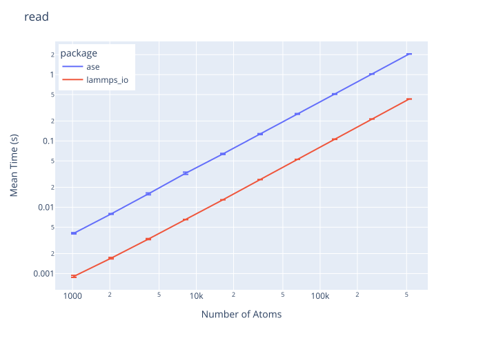
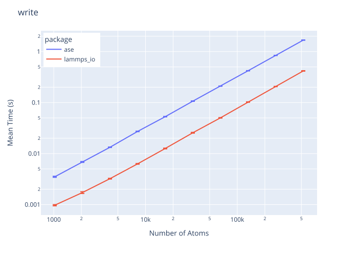

# LAMMPS I/O
This project provides a Python interface for reading and writing LAMMPS data and dump files, with Rust-backed parsing for performance.

## Installation
```bash
pip install lammps-io
```


## How to Use
```python
import lammps_io as lio


# Load a LAMMPS data file
data = lio.data.read("path/to/lammps.data")


atom_poses = lio.data.get_atom_poses(data)
# >>> [[0.0, 0.0, 0.0], [1.0, 0.0, 0.0], ...]

atom_poses_dict = lio.data.get_atom_poses_dict(data)
# >>> {1: [0.0, 0.0, 0.0], 2: [1.0, 0.0, 0.0], ...}

lio.data.update_atom_poses(
    data,
    {
        1: [0.1, 0.0, 0.0],
        2: [-0.1, 0.0, 0.0],
    },
)
lio.data.write("path/to/updated_lammps.data", data)

```


## Benchmark Results




